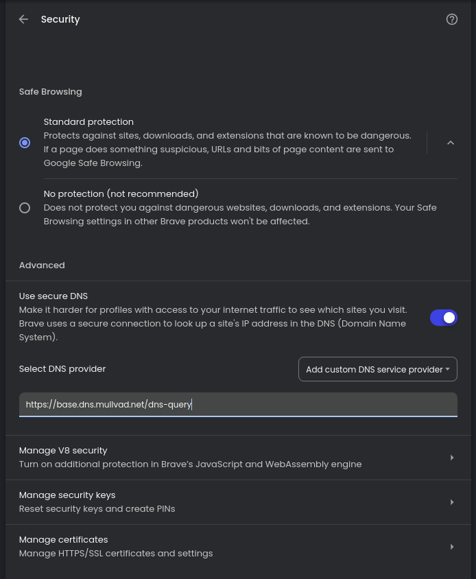

<h1 align= "center">Brave-Hardening-Guide<h1>

How to make Brave browser as private as possible

<h2 align="center">What is the Brave browser?</h2>

The Brave browser is a free,[open-source](https://github.com/brave/brave-core) web browser that prioritizes user privacy and security. It's built on the Chromium web browser, which is the foundation for Google Chrome. Brave is known for its built-in ad-blocking and tracking protection, which can make browsing faster and more private. It also offers a unique feature called Brave Rewards, where users can earn cryptocurrency (Basic Attention Token or BAT) for viewing privacy-respecting ads. Additionally, Brave has a built-in cryptocurrency wallet called Brave Wallet and a firewall and VPN service called Brave Firewall + VPN, which are available as paid options.

Brave is also known for its speed and efficiency. It's designed to use less memory and battery life compared to other browsers, which can be beneficial for users on mobile devices or older computers.

Overall, the Brave browser is a good choice for users who value privacy and security, and who want a browser that's fast and efficient.

<h2 align="center">Why Harden Brave?</h2>

Even though Brave is designed to protect your privacy, there are additional steps you can take to enhance its security and privacy features further. Here's why you might want to harden Brave:

<h3 align="center">Eliminate Telemetry</h3>

By default, Brave sends anonymous telemetry data. Hardening Brave can disable this data collection, ensuring that no information about your browsing habits is sent back to Brave's servers.

<h3 align="center">Block More Ads and Trackers</h3>

Hardening Brave makes the browser more aggressive at blocking ads and trackers. This means you are less likely to encounter unwanted ads, making your browsing experience faster and more private.

In summary, hardening Brave can make it an even more private and secure browser by stopping all telemetry and enhancing ad and tracker blocking capabilities.

<h2 align="center">How to Harden Brave</h2>

Here are some steps you can take to harden Brave and make it as private as possible:

<h3 align="center">1. Hardening via Brave Sheild</h3>

Brave Shield is a built-in feature that allows you to control the browser's ad-blocking and tracking protection settings. You can access Brave Shield by clicking on the lion icon in the address bar or going to: brave://settings/shields. Here are some settings you can adjust to enhance your privacy:

<h3 align="center">By default the settings should look something like this:</h3>

    

<h3 align="center">After hardening the settings should look like this:</h3>

    

## Before Hardening (Default Settings)

1. **Show the number of blocked items on the Shields icon:**
   - **On:** Displays a count of the blocked items (trackers, ads, etc.) directly on the Shields icon, giving you a quick overview of what's being blocked on the current page.

2. **Trackers & ads blocking:**
   - **Standard:** Blocks a balanced amount of trackers and ads to enhance privacy without breaking many websites.

3. **Upgrade connections to HTTPS:**
   - **Standard:** Automatically upgrades your connections to HTTPS where possible, ensuring that your data is encrypted.

4. **Block scripts:**
   - **Off:** Allows all scripts to run on websites. Scripts can enhance functionality but may also be used for tracking or malicious purposes.

5. **Block fingerprinting:**
   - **On:** Prevents websites from uniquely identifying your browser and device configuration, enhancing your privacy.

6. **Block cookies:**
   - **Block third-party cookies:** Prevents cookies from external sites (not the one you're visiting) from being stored, reducing tracking by advertisers.

7. **Forget me when I close this site:**
   - **On:** Deletes cookies and site data when you close the site, ensuring no data is stored between sessions.

8. **Content filtering:**
   - **Disabled:** No custom filters are applied to block additional regional or language-specific trackers and annoyances.

## After Hardening

1. **Show the number of blocked items on the Shields icon:**
   - **On:** Same as before, it shows the count of blocked items on the Shields icon.

2. **Trackers & ads blocking:**
   - **Aggressive:** Blocks a larger number of trackers and ads, increasing privacy but potentially causing more websites to break or function improperly.

3. **Upgrade connections to HTTPS:**
   - **Strict:** Forces all connections to HTTPS, providing maximum encryption but possibly causing issues with websites that do not support HTTPS.

4. **Block scripts:**
   - **Off:** Same as before, allows all scripts to run.

5. **Block fingerprinting:**
   - **On:** Same as before, continues to block fingerprinting techniques.

6. **Block cookies:**
   - **Block third-party cookies:** Same as before, blocking third-party cookies.

7. **Forget me when I close this site:**
   - **On:** Same as before, deletes cookies and site data when you close the site.

8. **Content filtering:**
   - **Disabled:** Same as before, no custom filters are applied.

## Summary

By hardening Brave, you mainly enhance its ability to block ads and trackers more aggressively and ensure stricter HTTPS connections. These changes improve privacy and security but may affect website functionality.

## Important Note on Script and Cookie Blocking

### Script Blocking

While Brave offers the option to block scripts, it's important to note that enabling this feature will likely break many websites and is not recommended for daily use unless absolutely necessary. Most modern websites rely heavily on JavaScript for their functionality, and blocking scripts can severely impact your browsing experience.

If you do choose to block scripts:
- Many interactive features on websites will not work
- Some websites may fail to load entirely
- You may need to frequently toggle this setting on and off to use certain sites

The "Block" button for scripts in Brave's settings, when enabled, prevents JavaScript from running on the websites you visit. This can enhance privacy and security by preventing potentially malicious scripts from executing, but it comes at the cost of reduced functionality on most websites.

For most users, it's recommended to keep script blocking turned off and rely on Brave's other privacy features, which provide a good balance between security and usability.

### Cookie Blocking

Brave allows you to choose between blocking all cookies or just third-party cookies. Here's what you need to know:

#### Blocking All Cookies:
- **Pros:** Maximum privacy as websites can't store any information about your visits.
- **Cons:** 
  - You'll be logged out of all websites each time you close your browser.
  - Many websites will not function properly or remember your preferences.
  - You may need to enter login information frequently.
  - Some online services, like shopping carts, may not work correctly.

#### Blocking Only Third-Party Cookies (Recommended):
- **Pros:** 
  - Blocks tracking cookies from external sites, enhancing privacy.
  - Allows first-party cookies, maintaining functionality for most websites.
- **Cons:** 
  - Some cross-site features might not work properly.
  - Some tracking is still possible through first-party cookies.

It's generally recommended to block only third-party cookies as this provides a good balance between privacy and usability. This setting allows websites to remember your login status and preferences while still blocking many tracking attempts from external sources.

For most users, blocking third-party cookies combined with Brave's other privacy features offers a solid level of protection without significantly impacting your browsing experience.

## Social Media Blocking

### Before Hardening (Default Settings)

1. **Allow Facebook logins and embedded posts:**
   - **On:** Enables Facebook logins and embedded Facebook content (such as posts and comments) on websites.

2. **Allow X (previously Twitter) embedded tweets:**
   - **On:** Allows embedded tweets from X (Twitter) to appear on websites.

3. **Allow LinkedIn embedded posts:**
   - **Off:** Blocks embedded LinkedIn content, preventing LinkedIn from tracking your activity through these embeds.

### After Hardening

1. **Allow Facebook logins and embedded posts:**
   - **Off:** Blocks Facebook logins and embedded content, preventing Facebook from tracking your activity on other sites through these embeds.

2. **Allow X (previously Twitter) embedded tweets:**
   - **Off:** Blocks embedded tweets, which can help prevent tracking by X but will also mean you won't see embedded tweet content on web pages.

3. **Allow LinkedIn embedded posts:**
   - **Off:** Remains off, continuing to block embedded LinkedIn content.

### Benefits and Drawbacks

- **Benefits:** Blocking these embeds can significantly enhance your privacy by reducing the ways these social media platforms can track your activity across different websites.
- **Drawbacks:** Disabling these features means you won't be able to see or interact with social media content directly on websites, and you won't be able to use social media logins for quick access to services that support it.

By adjusting these settings according to your privacy preferences, you can balance between convenience and privacy.

<h3 align="center">2. Privacy and Security - Settings</h3>

# Explanation of Brave Privacy and Security Settings

***all the setting that i go over here are located here: brave://settings/privacy***

## WebRTC IP Handling Policy

WebRTC (Web Real-Time Communication) is a feature that enables voice and video communication directly within the browser without needing plugins. However, it can expose your IP address even when using a VPN. Brave offers different settings to manage how WebRTC handles IP addresses:

1. **Default:**
   - **Behavior:** Allows WebRTC to enumerate all interfaces, potentially exposing both public and private IP addresses.
   - **Best For:** Users who need seamless WebRTC functionality for tasks like video calls without concern for IP exposure.

2. **Default Public and Private Interfaces:**
   - **Behavior:** WebRTC uses the default route for HTTP connections, exposing associated private IP addresses.
   - **Best For:** Users who want some level of IP protection but still need WebRTC to function efficiently.

3. **Default Public Interface Only:**
   - **Behavior:** Limits WebRTC to using only the public interface route used by HTTP, not exposing local IP addresses.
   - **Best For:** Users who want better privacy without completely disabling WebRTC.

4. **Disable Non-Proxied UDP:**
   - **Behavior:** Forces WebRTC to use TCP instead of UDP, preventing local IP addresses from being exposed. This setting can effectively disable WebRTC if the proxy server doesn't support UDP.
   - **Best For:** Maximum privacy, suitable for users who prioritize security over the functionality of WebRTC.

**Best for Privacy and Security:** For the highest level of privacy, **"Disable Non-Proxied UDP"** is recommended. This setting ensures that WebRTC doesn't expose any local IP addresses, providing maximum protection against IP leaks.

## Other Privacy and Security Settings
### it's not recommended to disable the following settings as they impact your browsing security:

1. **Use Google Services for Push Messaging:**
   - **Off:** Disables push notifications that use Google's services, enhancing privacy by not relying on external notification services.

2. **Auto-redirect AMP Pages:**
   - **On:** Redirects AMP (Accelerated Mobile Pages) to their canonical (original) URLs, avoiding Google's AMP framework which can track user activity.

3. **Auto-redirect Tracking URLs:**
   - **On:** Bypasses tracking redirects, preventing websites from tracking your clickthrough behavior via URL redirects.

4. **Prevent sites from fingerprinting me based on my language preferences:**
   - **On:** Reduces the information sites can gather about your language settings, making it harder for them to create a unique fingerprint of your device.

5. **Send a "Do Not Track" request with your browsing traffic:**
   - **Off (by default):** Sends a request to websites asking them not to track you. Note that websites can choose to ignore this request.

These settings collectively enhance your browsing privacy by reducing the amount of data shared with external services and preventing various forms of tracking.

## Summary of Recommended Settings

For maximum privacy and security in Brave Browser, I recommend the following:

1. **WebRTC IP Handling Policy:** Set to "Disable Non-Proxied UDP"
   - This provides the highest level of protection against IP leaks through WebRTC.
2. **Other WebRTC settings:** Keep at their default values
   - Changing these may impact browser functionality without significant privacy gains.
3. **Additional Privacy Settings:** Enable as described in the "Other Privacy and Security Settings" section below
   - These settings enhance overall privacy without compromising basic browsing experience.

Remember, maximizing privacy may affect some website functionalities. Adjust settings based on your personal privacy needs and browsing habits.

## Note on "Do Not Track" Setting

The "Send a 'Do Not Track' request with your browsing traffic" setting deserves special consideration:

- **Default Setting:** Off
- **Recommendation:** Consider carefully before enabling

**Why you might want to keep it off:**

1. **Limited Effectiveness:** Many websites ignore or don't honor this request.
2. **Increased Fingerprinting Risk:** Paradoxically, enabling this setting can make your browser more uniquely identifiable (fingerprintable).
3. **Inconsistent Interpretation:** Websites may interpret and respond to this request differently:
   - Some might show non-personalized ads instead of targeted ones.
   - Others may still collect and use your browsing data for various purposes (e.g., security, content provision, analytics).

**Understanding "Do Not Track":**
- It's a request included with your browsing traffic.
- Its effect depends on whether and how websites respond to it.
- It doesn't prevent data collection by itself; it relies on the willingness of websites to honor the request.

**Bottom Line:** 
While the intent behind "Do Not Track" is privacy-focused, its practical impact is limited and it may unintentionally make your browser stand out. For most users, keeping this setting off and relying on Brave's other robust privacy features is likely the better choice for maintaining the best privacy online.

**Image for recommended settings for those wondering:**

  

# Tor Settings in Brave Browser vs Normal Tor Browser

## Tor Windows Settings in Brave

  

### 1. Private Window with Tor

- **What it does:** Opens a private browsing window that uses the Tor network to hide your IP address from the sites you visit.
- **Pros:**
  - Enhanced privacy by masking your IP address.
  - Access to onion services and websites blocked in your region.
- **Cons:**
  - Slower browsing speeds due to routing through multiple Tor nodes.
  - Some websites may not work correctly due to IP address changes.
- **Recommendation:** While this offers additional privacy, it's not as robust as the dedicated Tor Browser, which provides more comprehensive protection and anonymity.

### 2. Only Resolve .onion Addresses in Tor Windows

- **What it does:** Restricts access to .onion sites to Tor windows only.
- **Pros:**
  - Prevents accidental access to onion sites in non-Tor windows, which could compromise privacy.
- **Cons:**
  - Limits the ability to access .onion sites without opening a Tor window.
- **Recommendation:** Useful for ensuring that onion sites are accessed securely through Tor.

### 3. Volunteer to Help Others Connect to the Tor Network

- **What it does:** Enables the Snowflake extension, allowing users in censored countries to connect to the Tor network through your connection.
- **Pros:**
  - Helps support the Tor network and users in restricted regions.
  - Enhances the robustness and accessibility of the Tor network.
- **Cons:**
  - Uses some of your bandwidth to relay traffic.
  - Potential minor impact on your internet speed.
- **Recommendation:** Beneficial for those who want to support internet freedom and have sufficient bandwidth.

### 4. Use Bridges

- **What it does:** Allows the use of Tor bridges to connect to the Tor network in regions where it is blocked.
- **Pros:**
  - Provides access to Tor in censored regions.
  - Enhances the ability to bypass government or ISP blocks on Tor.
- **Cons:**
  - May require additional configuration.
  - Some bridges might be slower or less reliable.
- **Recommendation:** Essential for users in regions with heavy censorship; useful to have this option available.

## Why Tor Mode in Brave is Not Recommended Over the Normal Tor Browser

### Tor Mode in Brave:
- **Integration:** Tor mode in Brave offers easy access to Tor within the Brave browser.
- **Convenience:** Convenient for users who want occasional anonymity without switching browsers.
- **Limitations:** Provides basic Tor functionalities but lacks the full suite of privacy features available in the Tor Browser.

### Normal Tor Browser:
- **Comprehensive Privacy:** Designed specifically for anonymity, providing robust privacy protections.
- **Security Features:** Includes additional security measures such as NoScript, which prevents JavaScript exploits.
- **Updates:** Regular updates directly from the Tor Project to address vulnerabilities and enhance security.
- **Community Support:** Extensive support and documentation from the Tor community for troubleshooting and advanced configurations.

## Conclusion

- **Best for Maximum Privacy:** Use the Tor Browser for the most secure and private browsing experience.
- **Best for Convenience:** Use Tor mode in Brave for occasional private browsing with easy access to both Tor and regular websites.

## Summary

- Brave offers Tor integration for enhanced privacy, but it's not as comprehensive as the dedicated Tor Browser.
- Key Brave Tor settings include Private Window with Tor, .onion address resolution, and options to support the Tor network.
- While convenient, Brave's Tor mode lacks some advanced privacy features of the normal Tor Browser.
- For maximum privacy and anonymity, the dedicated Tor Browser is recommended.
- Use Brave's Tor features for occasional private browsing when convenience is preferred over maximum security.

*I just turn TOR mode off completely as it's not as secure as the normal TOR browser.*

  

## Data Collection Settings

When hardening Brave for maximum privacy, disable the following settings:

1. Allow privacy-preserving product analytics (P3A)
2. Automatically send daily usage ping to Brave
3. Automatically send diagnostic reports

Although these collect anonymous data to improve Brave, disabling them ensures no data is sent back to Brave servers, enhancing privacy.

  

**Recommendation:** Turn OFF all data collection settings for the highest level of privacy when hardening Brave.

  

<h4>brave://settings/security</h4>

### Safe Browsing

#### **Safe Browsing:**
- **Standard Protection:**
  - **Function:** Protects against dangerous websites, downloads, and extensions by checking them against a database of known threats. When a page looks suspicious, some data is sent to Google's Safe Browsing to verify its safety.
  - **Why It's Important:** Disabling Safe Browsing removes a crucial layer of protection against malware, phishing attacks, and other online threats, leaving you vulnerable to malicious content.

#### **Default Settings (OS Default):**
- **Function:** Uses the DNS (Domain Name System) resolver set by your operating system or network provider.
- **Pros:** Simple and reliable, uses existing system settings without additional configuration.
- **Cons:** May not provide the best privacy, as ISPs (Internet Service Providers) can log and monitor your DNS queries.

  

#### **Custom Settings (Using Mullvad DNS):**
- **Function:** Configured to use Mullvad DNS (https://base.dns.mullvad.net/dns-query), a privacy-focused DNS service.
- **Pros:** Enhances privacy by using a DNS provider that does not log your DNS queries or track your browsing activity.
- **Cons:** Requires manual configuration.

  

### Secure DNS

#### **Secure DNS:**
- **What It Does:** Encrypts DNS queries, preventing third parties from seeing which websites you visit. This is done by using protocols like DNS over HTTPS (DoH) or DNS over TLS (DoT).
- **Importance:**
  - **Privacy:** Protects against eavesdropping and manipulation of DNS data by ensuring that your DNS requests are encrypted and secure.
  - **Security:** Reduces the risk of DNS spoofing attacks, where attackers redirect you to malicious sites by altering DNS responses.

### Summary
- **Safe Browsing:** Essential for security; should remain enabled to protect against online threats.
- **Default DNS Settings:** Convenient but may compromise privacy.
- **Custom DNS (Mullvad):** Offers enhanced privacy and security by using a DNS provider that respects user privacy.
- **Secure DNS:** Crucial for maintaining privacy and security online by encrypting DNS queries and protecting against various attacks.

# V8 Optimizer in Brave Browser
***brave://settings/content/v8***
#### **What is the V8 Engine?**
The V8 engine is an open-source JavaScript engine developed by Google, which is used in both Google Chrome and Brave browsers. It is responsible for executing JavaScript code in the browser, allowing websites to perform dynamic actions and interact with users. V8 compiles JavaScript directly to native machine code before executing it, which makes it very fast.

#### **V8 Optimizer:**
- **Default Behavior:**
  - **Sites Can Use the V8 Optimizer:** This setting allows the V8 engine to optimize JavaScript execution, which can significantly improve site performance and speed. It ensures that features using JavaScript work as intended.
  - **Don't Allow Sites to Use the V8 Optimizer:** Disabling this can reduce performance but makes the V8 engine more resistant to certain types of attacks, potentially increasing security.

#### **Customizing V8 Optimizer Behavior:**
- **Blacklisting Sites (Not Allowed to Use V8 Optimizer):**
  - You can add specific websites to a blacklist to prevent them from using the V8 optimizer. This might be useful for sites where you suspect the JavaScript could be malicious or where you experience performance issues that could be related to V8 optimizations.
  - **How to Add:** Click the "Add" button under "Not allowed to use V8 optimizer" and enter the URLs of the sites you want to restrict.

- **Whitelisting Sites (Always Allowed to Use V8 Optimizer):**
  - You can also add specific websites to a whitelist to ensure they always benefit from V8 optimizations, even if you generally prefer to restrict this feature.
  - **How to Add:** Click the "Add" button under "Always allowed to use V8 optimizer" and enter the URLs of the sites you want to allow.

### Summary
- **V8 Engine:** A high-performance JavaScript engine that enhances the speed and functionality of web applications.
- **V8 Optimizer:** Improves site performance by optimizing JavaScript execution. You can control its usage:
  - **Default Behavior:** Generally recommended for better performance.
  - **Custom Behavior:** Allows for specific sites to be blacklisted or whitelisted based on your preferences for performance and security.

*I personally keep it as default:*

  

